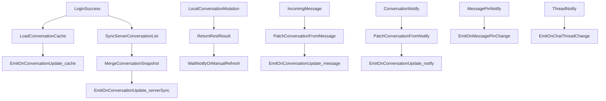

# 功能规格：会话相关 REST API 收敛（Conversation / Silent Mode / ChatThread）

**Feature Branch**: `034-conversation-rest-api`  
**Created**: 2026-04-28  
**Status**: Draft  
**Input**: 用户需求："在 websdk 目录下面的，会话相关的 restapi，按 websdk2 当前风格进行迁移。demo、websdk 内部调用、外部调用、以及发送的事件，先帮我编写 spec。"

**Reference**:

- 旧工程会话主线 API：`../websdk/packages/IM/sdk/src/apis/index.ts`
- 旧工程子区 API：`../websdk/packages/IM/sdk/src/apis/threadApi.ts`
- 旧工程会话免打扰 API：`../websdk/packages/IM/sdk/src/apis/silentModeApi.ts`
- 旧工程会话/子区事件：`../websdk/packages/IM/sdk/src/handleMessages/handleNotify.ts`
- 旧工程子区 MUC 事件：`../websdk/packages/IM/sdk/src/handleMessages/handleMucMsg.ts`
- 旧工程会话类型：`../websdk/packages/IM/sdk/src/types/indexApi.ts`
- 当前会话 REST 基线：`src/apis/index.ts`
- 当前 ChatClient 会话同步：`src/chat-client.ts`
- 当前事件系统：`specs/004-event-system/spec.md`
- 当前 Manager 机制：`specs/009-manager-usage/spec.md`
- 当前 PushManager：`specs/021-push-manager/spec.md`
- 当前 ChatManager Phase 1：`specs/031-chat-manager-replace-channel/spec.md`
- 命名规范：`docs/reference/sdk-naming-conventions.md`
- REST 映射与样例约束：`.specify/memory/constitution.md`

## Clarifications

### Session 2026-04-28

- Q: 本次“会话相关 REST API”spec 覆盖范围是什么？ → A: 覆盖会话主线、会话免打扰、子区 thread 三部分，作为同一 feature 一次性定义。
- Q: 旧 `conn.contact.*`、旧方法名、旧参数名是否保留兼容层？ → A: 不保留；按 `websdk2` 新风格直接收敛。
- Q: 对外公开的会话类型使用哪套 canonical 命名？ → A: 统一使用 `singleChat`、`groupChat`、`chatRoom`；内部兼容旧缓存或服务端别名映射，但不对外暴露。
- Q: 本 feature 与 `031-chat-manager-replace-channel` 的关系是什么？ → A: `031` 负责 Phase 1 的消息域替换；`034` 负责其后续阶段的 conversation capability 补齐，不推翻 `031` 在 Phase 1 中对 `ChatManager` 范围的限制。
- Q: 本期会话缓存模型是否同步升级到新的公开 canonical naming？ → A: 是；本期同步升级缓存 schema，使公开 DTO 与缓存/落盘层统一使用 `singleChat`、`groupChat`、`chatRoom`，并补迁移逻辑。
- Q: `ChatThreadManager` 的公开事件注册面是否使用专属 handler map？ → A: 是；`ChatThreadManager` 使用专属 thread handler map，同时 thread 事件类型仍进入全局事件类型体系。
- Q: 会话 mutation 成功后的同步策略是否延续旧 `websdk` 风格，不主动 patch 当前会话列表？ → A: 是；本期延续旧 `websdk` 风格，conversation mutation 成功后主要返回 REST 结果，并依赖后续事件或调用方主动刷新保证会话列表一致性。
- Q: 若 mutation 成功后不自动 patch 当前会话列表，默认由谁负责后续刷新？ → A: 默认由调用方在需要时主动刷新列表；SDK 负责返回标准化 REST 结果和后续事件，不在 mutation 成功后偷偷触发内部列表刷新。
- Q: 调用方主动刷新会话列表时，是否提供专门刷新 API？ → A: 不提供；调用方直接复用 `getConversationList()` 作为主动刷新入口。

## 设计决策

### 1. 阶段定位

本 feature 不是重新定义 `ChatManager` 的 Phase 1，而是承接 `031-chat-manager-replace-channel` 之后的下一阶段：

- `031` 已完成“消息域入口由 `ChannelManager` 收敛到 `ChatManager`”。
- `034` 在此基础上补齐 conversation 主线 REST、会话相关事件补全、thread 域独立 manager 和 demo / 文档统一入口。
- `034` 不回滚 `031` 的 breaking change 方向，也不重新引入 `ChannelManager`、`Channel` 或 connection 根对象风格的公开入口。

### 2. 域划分与公开入口

本期不把“会话相关”强行塞进单一 manager，而是按当前 `websdk2` 已形成的域模型收敛：

| 能力域 | 新公开入口 | 内部实现归属 | 说明 |
| --- | --- | --- | --- |
| 会话主线（列表、删除、置顶、标记、消息置顶） | `ChatManager` | 会话域 service / repository + `src/rest/conversation-management.ts` | 属于聊天主域，与 `onConversationListUpdate`、会话缓存和 demo 会话面板直接耦合 |
| 会话免打扰 / 推送提醒 | `PushManager` | 复用现有 `PushManager`，必要时补充 conversation silent mode REST 模块 | 该域已在 `021-push-manager` 中按新风格落地，不迁入 `ChatManager` |
| 子区 thread | `ChatThreadManager` + `ChatThread` | thread 域 service / repository + `src/rest/chat-thread-management.ts` | 作为独立资源域落地，避免把 thread CRUD 混入 `ChatManager` |

### 3. 公开命名与内部兼容分层

本期对“会话类型”和“领域名”的要求分三层：

1. **公开输入输出层**
   - conversation type 统一使用 `singleChat`、`groupChat`、`chatRoom`
   - thread 公开领域名统一使用 `chatThread`
   - 不再对外暴露 `session`、`single/group/room`、`thread/messageThread/subThread` 等并行命名

2. **SDK 内部兼容层**
   - 允许兼容旧服务端或旧缓存中的 `single/group/room`
   - 允许兼容旧 notify 中的原始 `operation` 文本
   - 兼容只发生在 SDK 内部 normalize / mapping 过程中，不对外泄漏

3. **缓存 / 落盘层**
   - 本期同步升级 conversation cache schema，使缓存/落盘层与公开 DTO 一致使用 `singleChat`、`groupChat`、`chatRoom`
   - 旧缓存读取必须提供迁移或兼容回填逻辑，确保已有 `single/group/room` 落盘数据不会导致会话列表读取失败
   - 本期新增的 `marks`、扩展后的 `source` 语义及相关字段，必须在 schema 升级方案中一并处理，避免公开 DTO 与缓存真相再次分叉

### 4. manager 职责边界

本期继续遵循“公开入口负责参数校验与编排，复杂领域逻辑由内部模块承接”的边界：

- `ChatManager` 负责 conversation 公开入口、参数校验、错误归一化和事件注册入口。
- `ChatThreadManager` 负责 thread 公开入口、句柄获取和事件注册入口。
- `ChatClient` 与对应领域 service / repository 负责登录后同步、缓存升级、事件派发时机控制，以及按最终规格决定是否对当前会话状态做主动刷新。
- REST 模块负责上游请求映射、响应解析与错误映射。

因此，本期不把“`ChatManager` 直接持有缓存补丁与事件派发真相”作为强制设计，而是要求公开入口和内部职责保持清晰分层。

### 5. 事件收敛原则

- 不再对外暴露旧 `onMultiDeviceEvent` 这种“靠 `operation` 自解析”的会话泛事件作为主入口。
- 会话摘要变化统一通过 `onConversationListUpdate` 暴露。
- 会话内消息置顶变化通过新事件 `onPinnedMessageChanged` 暴露。
- thread 变化通过 `ChatThreadManager` 的 typed 事件暴露，不复用会话主事件。
- 会话免打扰本期不新增公开事件；调用方通过 `PushManager` 读写结果管理 UI 状态。
- 内部原始 notify 可以保留原始字段，但必须先在 SDK 内部完成 normalize，再进入公开 typed event surface。

### 6. 会话缓存与事件链扩展目标

当前 SDK 的 `onConversationListUpdate` 主要只覆盖“登录后读缓存 + 服务端全量同步”。在本期延续旧 `websdk` mutation 同步风格的前提下，对外事件语义目标如下：



说明：

- 这里表达的是公开行为目标，不要求实现必须严格按图中的类名或文件名组织。
- 只有当快照实际发生业务变化时，才要求派发对应更新事件。
- conversation mutation 成功本身不等于必须立即派发 `onConversationListUpdate`；若延续旧流程，则应通过后续 notify、自触发刷新或调用方主动刷新来获得列表一致性。

## API 命名与归属收敛

### 会话主线映射

| 旧 API | 新公开 API | 新归属 |
| --- | --- | --- |
| `getSessionList` | `getConversationList` | `chatManager` |
| `getConversationlist` | `getConversationList` | `chatManager` |
| `getServerConversations` | `getConversationList` | `chatManager` |
| `getServerPinnedConversations` | `getPinnedConversationList` | `chatManager` |
| `deleteSession` / `deleteConversation` | `deleteConversation` | `chatManager` |
| `pinConversation` | `setConversationPinned` | `chatManager` |
| `addConversationMark` | `addConversationMark` | `chatManager` |
| `removeConversationMark` | `removeConversationMark` | `chatManager` |
| `getServerConversationsByFilter` | `getConversationListByMark` | `chatManager` |
| `deleteAllMessagesAndConversations` | `clearAllMessagesAndConversations` | `chatManager` |
| `pinMessage` | `pinMessage` | `chatManager` |
| `unpinMessage` | `unpinMessage` | `chatManager` |
| `getServerPinnedMessages` | `getPinnedMessageList` | `chatManager` |

### 会话免打扰映射

| 旧 API | 新公开 API | 新归属 |
| --- | --- | --- |
| `setSilentModeForConversation` | `setConversationSilentMode` | `pushManager` |
| `clearRemindTypeForConversation` | `clearConversationRemindType` | `pushManager` |
| `getSilentModeForConversation` | `getConversationSilentMode` | `pushManager` |
| `getSilentModeForConversations` | `getConversationSilentModes` | `pushManager` |
| `getSilentModeRemindTypeConversations` | `getConversationListByRemindType` | `pushManager` |
| `setSilentModeForAll` | `setGlobalSilentMode` | `pushManager` |
| `getSilentModeForAll` | `getGlobalSilentMode` | `pushManager` |

### 子区映射

| 旧 API | 新公开 API | 新归属 |
| --- | --- | --- |
| `createChatThread` | `createChatThread` | `chatThreadManager` |
| `joinChatThread` | `chatThread.join()` | `ChatThread` |
| `leaveChatThread` | `chatThread.leave()` | `ChatThread` |
| `destroyChatThread` | `chatThread.destroy()` | `ChatThread` |
| `changeChatThreadName` | `chatThread.updateName()` | `ChatThread` |
| `getChatThreadMembers` | `chatThread.getMemberList()` | `ChatThread` |
| `removeChatThreadMember` | `chatThread.removeMember()` | `ChatThread` |
| `getJoinedChatThreads` | `getJoinedChatThreadList` | `chatThreadManager` |
| `getChatThreads` | `getChatThreadList` | `chatThreadManager` |
| `getChatThreadLastMessage` | `getChatThreadLastMessageList` | `chatThreadManager` |
| `getChatThreadDetail` | `chatThread.getInfo()` | `ChatThread` |

## 事件模型

### ChatManager 事件

`ChatManager` 保留并扩展会话域事件：

```ts
type ConversationListUpdateReason =
  | 'cache'
  | 'serverSync'
  | 'message'
  | 'localMutation'
  | 'notify';

interface ConversationUpdatePayload {
  items: ReadonlyArray<ConversationItem>;
  source: ConversationListUpdateReason;
}

interface PinnedMessageChangedEventPayload {
  conversationId: string;
  conversationType: ConversationPublicType;
  messageId: string;
  operation: 'pin' | 'unpin';
  operatorId?: string;
  timestamp: number;
}
```

约束：

- `onConversationListUpdate` 只表达“当前会话摘要视图发生变化”，不再附带旧 `operation` 细节。
- 若调用方需要消息置顶的细粒度变化，使用 `onPinnedMessageChanged`，而不是继续解析多端泛事件。
- `onPinnedMessageChanged` 必须进入公开 `EventPayloadMap`，具备 TypeScript 类型约束。

### ChatThreadManager 事件

`ChatThreadManager` 提供 thread 域的公开 typed event：

```ts
type ChatThreadChangeType =
  | 'created'
  | 'updated'
  | 'destroyed'
  | 'joined'
  | 'left'
  | 'memberRemoved';

interface ChatThreadChangeEvent {
  change: ChatThreadChangeType;
  chatThreadId: string;
  parentId: string;
  operatorId?: string;
  memberId?: string;
  thread?: ChatThreadSummary;
  timestamp: number;
}
```

约束：

- 旧 `onChatThreadChange` 的 socket 原始字段必须在 SDK 内部完成标准化；调用方不再解析服务端 `operation` 文本。
- `onChatThreadChange` 必须进入公开 `EventPayloadMap`，并由 `chatThreadManager.addEventHandler()` 暴露给调用方。
- `ChatThreadManager.addEventHandler()` 必须使用专属 thread handler map，只接受 thread 域事件，而不是复用 chat 全局 handler map 作为对外类型面。
- thread 事件类型仍需进入全局事件类型体系，保证统一的事件常量、payload 约束与内部分发能力。

### PushManager 事件

- 本期不为 conversation silent mode 新增公开事件。
- `PushManager` 的 conversation silent mode mutation/read 结果即视为状态真相。
- 若未来会话列表需要直接展示免打扰标记，届时再决定是扩展 `ConversationItem` 还是新增独立 preference event。

## 调用面目标

### 对外调用目标

```ts
import {
  ChatClient,
  ChatManager,
  PushManager,
  ChatThreadManager,
} from 'im-sdk-web';

const client = ChatClient.init({ appKey: 'org#app' })
  .use(ChatManager)
  .use(PushManager)
  .use(ChatThreadManager);

client.chatManager.addEventHandler('conversation-ui', {
  onConversationListUpdate: ({ items, source }) => {
    console.log(source, items);
  },
  onPinnedMessageChanged: event => {
    console.log(event.operation, event.messageId);
  },
});

client.chatThreadManager.addEventHandler('thread-ui', {
  onChatThreadChange: event => {
    console.log(event.change, event.chatThreadId);
  },
});

const page = await client.chatManager.getConversationList({
  pageSize: 20,
  cursor: '',
  includeEmptyConversations: false,
});

await client.chatManager.setConversationPinned({
  conversationId: 'group_123',
  conversationType: 'groupChat',
  pinned: true,
});

await client.pushManager.setConversationSilentMode({
  conversationId: 'group_123',
  type: 'groupChat',
  rule: { mode: 'REMIND_TYPE', remindType: 'NONE' },
});

const created = await client.chatThreadManager.createChatThread({
  parentId: 'group_123',
  name: 'Topic A',
  messageId: 'mid_001',
});

await client.chatThreadManager.getChatThread(created.chatThreadId).join();
```

### demo 目标

- `demo/src/App.tsx` 负责注册 `chatManager` 和 `chatThreadManager` 事件。
- 会话面板以 `onConversationListUpdate` 为主要列表事件来源，但若本期延续旧 `websdk` mutation 流程，demo 必须明确区分“事件驱动刷新”和“操作后主动刷新”，且默认由调用方通过 `getConversationList` 等公开入口主动刷新。
- 会话设置/推送面板继续通过 `pushManager` 管理 conversation silent mode。
- 子区面板通过 `chatThreadManager` 完成创建、列表、详情和事件联动。

### SDK 内部调用目标

- `ChatClient.login()` 继续负责登录后首次 `loadCachedConversations -> syncServerConversations` 的时机控制。
- conversation REST 请求应收敛到新的 conversation REST 模块，不再长期停留在 `src/apis/index.ts` 的混装状态。
- 登录后同步、消息驱动更新、notify 驱动更新，以及 mutation 成功后的后续一致性处理，应由 `ChatClient` 或内部领域模块统一编排；若未选择自动刷新，则调用方直接复用 `getConversationList()` 等公开读取 API 主动刷新。
- message pin notify 与 thread notify 在协议层或领域适配层完成 normalize 后，再分别派发 `onPinnedMessageChanged` 和 `onChatThreadChange`。

## User Scenarios & Testing _(mandatory)_

### User Story 1 - 通过 ChatManager 统一访问会话主线 REST (Priority: P1)

作为 SDK 使用者，我希望所有服务端会话主线 REST 都通过 `chatManager` 访问，并返回统一的分页结果和会话摘要对象，同时会话变化能通过事件或明确的刷新动作回流到当前会话状态，这样我不需要再混用旧 connection API、手写 REST 或自己猜测会话列表何时更新。

**Why this priority**: 会话列表、删除、置顶、标记和消息置顶是旧 `websdk` 会话 REST 的核心价值，也是 demo 与上层业务最先依赖的能力。如果这部分不先收敛，thread 和 silent mode 即使完成迁移，外部调用主路径仍然割裂。

**Independent Test**: 登录后调用 `chatManager.getConversationList()`、`setConversationPinned()`、`deleteConversation()`、`addConversationMark()`、`pinMessage()`，验证返回契约、后续事件或主动刷新后的列表一致性，以及 `onConversationListUpdate` / `onPinnedMessageChanged` 事件即可独立证明主链路成立。

**Acceptance Scenarios**:

1. **Given** 已登录的 client 且已注册 `ChatManager`，**When** 调用 `chatManager.getConversationList({ cursor, pageSize, includeEmptyConversations })`，**Then** SDK 返回标准化分页结果，不再暴露旧 `channel_infos` 包装结构。
2. **Given** 某会话被执行置顶、取消置顶、删除或标记变更，**When** 对应 `chatManager` mutation 成功，**Then** SDK 先返回标准化 REST 结果；若调用方需要立即看到列表一致性，默认通过再次调用 `getConversationList()` 主动刷新。
3. **Given** 某会话内消息被置顶或取消置顶，**When** `pinMessage` / `unpinMessage` 成功或收到服务端通知，**Then** SDK 派发 `onPinnedMessageChanged`，而不是旧 `onMessagePinEvent`。
4. **Given** 登录成功且本地存在缓存会话，**When** `ChatClient` 完成“先读缓存、再拉服务端”的同步，**Then** 调用方可以先收到缓存事件，再在服务端差异存在时收到服务端同步事件。

---

### User Story 2 - 在 PushManager 中统一管理会话免打扰 (Priority: P1)

作为 SDK 使用者，我希望会话级免打扰、批量查询和按提醒类型分页查询继续归 `pushManager` 管理，并与全局免打扰保持同一套规则模型，这样我既能复用当前 `021-push-manager` 的风格，也不会把会话列表 mutation 和推送策略 mutation 混成一个 manager。

**Why this priority**: 会话免打扰虽然属于 conversation-related scope，但在 `websdk2` 中已经以 `PushManager` 形态落地；本期如果强行迁入 `ChatManager`，会破坏当前新风格的一致性并引入无必要的心智切换。

**Independent Test**: 调用 `pushManager.setConversationSilentMode()`、`getConversationSilentMode()`、`getConversationSilentModes()`、`getConversationListByRemindType()`，验证返回契约与 `021-push-manager` 一致即可。

**Acceptance Scenarios**:

1. **Given** 业务需要设置会话免打扰，**When** 调用 `pushManager.setConversationSilentMode()`，**Then** 公开入口仍是 `pushManager`，而不是 `chatManager`。
2. **Given** 业务需要在会话列表页展示会话提醒状态，**When** 调用 `getConversationSilentModes()` 批量查询，**Then** 返回结果可按 `conversationId + type` 与会话列表关联，而不要求改造 `ConversationItem` 基本结构。
3. **Given** 调用方需要按提醒类型分页管理已设置免打扰的会话，**When** 调用 `getConversationListByRemindType()`，**Then** 返回标准化分页结果，不再依赖旧 `silentModeApi.ts` 原始 envelope。
4. **Given** 会话免打扰被修改，**When** mutation 成功，**Then** SDK 本期不额外派发新的会话免打扰事件；调用方可按需查询或自行更新 UI 状态。

---

### User Story 3 - 通过 ChatThreadManager + ChatThread 迁移子区 REST 与事件 (Priority: P1)

作为 SDK 使用者，我希望旧 `threadApi.ts` 里的能力迁移到独立的 `ChatThreadManager` 和 `ChatThread` 对象，而不是继续挂在 connection 根对象或混进 `chatManager`，这样 thread 的列表、详情、成员和事件都能形成自洽的域模型。

**Why this priority**: thread 是独立资源而不是会话列表的一个字段；把它挂到独立 manager 更符合当前 `websdk2` 的 manager 化方向，也更接近 `GroupManager` / `ChatRoomManager` 的组织方式。

**Independent Test**: 完成 `client.use(ChatThreadManager)`、`createChatThread()`、`getJoinedChatThreadList()`、`getChatThread(chatThreadId).getInfo()` 和 thread 事件注册，即可独立验证该故事。

**Acceptance Scenarios**:

1. **Given** 调用方使用 `client.use(ChatThreadManager)`，**When** 初始化完成，**Then** thread 域能力应通过 `client.chatThreadManager` 暴露，而不是挂在 `chatManager` 或 `ChatClient` 根对象。
2. **Given** 调用方需要创建子区并随后在详情页管理该子区，**When** 调用 `createChatThread()` 后再使用 `getChatThread(chatThreadId)`，**Then** 可通过 `ChatThread` 对象执行 `join`、`leave`、`destroy`、`updateName`、`getMemberList`、`removeMember`、`getInfo`。
3. **Given** 服务端下发 thread 创建、更新、销毁或成员变更通知，**When** `chatThreadManager` 已注册事件处理器，**Then** 回调收到标准化的 typed payload，而不是旧 `onChatThreadChange + operation` 的原始透传。
4. **Given** 调用方需要批量获取多个子区的最后一条消息，**When** 调用 `getChatThreadLastMessageList({ chatThreadIds })`，**Then** 返回归一化后的业务结果，而不是旧 `entities.thread_id / last_message` 结构。

---

### User Story 4 - demo、内部调用与对外文档统一使用新入口 (Priority: P2)

作为 SDK 使用者和 SDK 维护者，我希望 demo、内部同步逻辑、对外文档和示例都统一使用 `chatManager`、`pushManager`、`chatThreadManager` 这三种入口，这样迁移完成后不会再同时出现旧 `conn.contact`、旧 connection 根方法和新 manager 三套心智。

**Why this priority**: 这是保证迁移结果真正可被采用的最后一步。没有 demo、内部调用和文档统一，即使底层 REST 能力已经重构完成，使用方仍会继续沿用旧方式。

**Independent Test**: 检查 demo、对外文档示例和 `ChatClient` 内部调用链都使用新入口，即可独立验证这一故事。

**Acceptance Scenarios**:

1. **Given** `demo` 需要展示会话列表与会话操作，**When** demo 初始化与登录完成，**Then** 会话 UI 应通过 `chatManager.addEventHandler()` 消费 `onConversationListUpdate`，并通过 `chatManager` / `pushManager` / `chatThreadManager` 执行动作。
2. **Given** `ChatClient` 需要在登录后同步服务端会话列表，**When** SDK 内部执行同步，**Then** 内部调用链应走新的会话 REST 模块与统一的快照合并逻辑，而不是继续在 `src/apis/index.ts` 中保留长期混装。
3. **Given** 文档和示例需要说明会话、免打扰和 thread 的使用方式，**When** 对外展示主路径，**Then** 只展示新的 manager 入口，不再展示旧 `connection.getServerConversations()`、`connection.createChatThread()` 或 `conn.contact.*`。

### Out of Scope

- 旧 `websdk` 的运行时代码兼容层、桥接层或 deprecated alias。
- 会话未读数重构、消息历史 REST、漫游消息读取、消息撤回等非本期“会话相关 REST”范围。
- group / chatroom 现有 manager 的命名和实现调整。
- 本期把会话免打扰硬并入 `ConversationItem` 模型。
- 本期直接敲定 conversation cache 最终 schema 或 thread 事件 handler map 的最终代码结构。

### Edge Cases

- `getSessionList` 与 `getConversationlist` 旧语义不同，但本期统一收敛为 `getConversationList`；旧“仅列表、不带最后一条消息”的读取语义不再保留为独立公开 API。
- 旧 `deleteConversation` 使用 `channel`、`chatType`、`deleteRoam`；新 API 统一改为 `conversationId`、`conversationType`、`deleteRoamingMessages`，且 `conversationType` 对外仅接受 `singleChat/groupChat/chatRoom`。
- SDK 内部需要兼容旧服务端或缓存中的 `single/group/room` 表达，但标准化后对外返回与入参都必须使用 `singleChat/groupChat/chatRoom`，不允许混用字符串别名。
- 若旧缓存中不存在 `marks` 或扩展后的 `source` 相关信息，SDK 必须按向前兼容方式降级，而不是因为字段缺失导致读取失败。
- 本期既然同步升级 conversation cache schema，方案阶段必须明确 cache schema version、迁移触发时机、旧数据回填规则和迁移失败时的降级策略。
- 当前 `onConversationListUpdate` 仅在登录后同步触发；若本期延续旧 `websdk` 风格不对本地 mutation 做主动 patch，则方案阶段必须明确 mutation 后默认由调用方直接复用 `getConversationList()` 主动刷新，并说明 notify 仅作为补充一致性来源。
- 会话消息置顶通知在单聊和群聊下 `conversationId` 组装方式不同；新 `onPinnedMessageChanged` payload 必须统一消除这一差异。
- thread 事件必须进入 typed event system，而不是继续透传旧 `operation` 字段让调用方自行 switch。
- thread 事件既要进入全局 typed event system，也要通过 `ChatThreadManager` 的专属 handler map 对外暴露，避免继续混入 chat 通用事件面。
- 会话免打扰属于 conversation-related scope，但本期不新增专门事件；若未来会话摘要模型增加免打扰字段，需再扩展相关公开事件。

## Test Layer Requirements _(mandatory)_

### Unit Tests

- Coverage goals: 覆盖会话 REST 参数校验、旧字段到新字段的映射、公开 DTO 归一化、`ConversationListUpdateReason` 扩展、`onPinnedMessageChanged` payload 归一化、thread REST 映射与 thread 事件映射。
- Planned location: `tests/unit/managers/chat-manager-conversation.test.ts`、`tests/unit/chat/conversation-rest-mapper.test.ts`、`tests/unit/managers/chat-thread-manager.test.ts`、`tests/unit/chat/chat-thread-event-mapper.test.ts`
- Not applicable rationale: N/A，本特性直接新增或重构公开 manager 方法、事件类型和字段映射，单元测试必需。

### Integration Tests

- Coverage goals: 覆盖 `ChatClient` 与 conversation REST 模块、`CacheManager`、`EventHub`、`PushManager`、`ChatThreadManager` 协作；验证“登录后缓存 + 服务端同步”“mutation 成功后通过后续机制达成列表一致性”“消息驱动会话更新”“通知驱动事件派发”“thread REST + thread notify”主链路。
- Planned location: `tests/integration/chat/conversation-sync.integration.test.ts`、`tests/integration/chat/conversation-mutation.integration.test.ts`、`tests/integration/chat-thread/chat-thread-manager.integration.test.ts`
- Not applicable rationale: N/A，本特性涉及管理器协作、缓存 / 同步链路和事件分发，集成测试必需。

### E2E Tests

- Coverage goals: 覆盖 demo 中会话列表展示、会话置顶 / 删除、会话免打扰配置和 thread 基础操作的浏览器主路径；验证 mutation 后默认通过公开读取 API 主动刷新列表，不出现“承诺自动刷新但实际不会刷新”的落差。
- Planned location: `tests/e2e/conversation-panel.spec.ts`、`tests/e2e/push-panel.spec.ts`、`tests/e2e/chat-thread-panel.spec.ts`
- Not applicable rationale: N/A，本期明确包含 demo 迁移目标，且影响浏览器主路径。

### Gate Impact

- Required gates: `npm run lint`、`npm run type-check`、`npm run test:gate:pr`、必要时 `npm run test:e2e`
- Validation notes: PR gate 必须阻断会话列表同步、会话 mutation、message pin 和 thread 事件回归；涉及 demo 主路径的改动必须评估并补充浏览器 E2E。

## Requirements _(mandatory)_

### Functional Requirements

- **FR-001**: 系统必须以 `ChatManager` 作为会话主线 REST 的唯一公开入口，不得重新引入 connection 根对象风格的会话 API。
- **FR-002**: 系统必须把旧 `getSessionList`、`getConversationlist`、`getServerConversations` 收敛为单一公开 API `getConversationList(params)`。
- **FR-003**: `getConversationList` 必须返回标准化分页结果，至少包含 `items` 与 `cursor`，不得继续对外暴露 `channel_infos`、`session_to`、`session_type` 等旧字段。
- **FR-004**: 会话主线公开读取模型必须以 `ConversationItem` 为基线，并补齐旧能力中的 `marks` 语义。
- **FR-005**: 公开 `ConversationItem` 必须至少稳定包含 `conversationId`、`conversationType`、`lastMessage`、`unreadCount`、`isPinned`、`pinnedTime`、`marks`、`lastAccess`、`lastUpdate`；其中 `conversationType` 对外固定使用 `singleChat`、`groupChat`、`chatRoom`。
- **FR-006**: 系统必须提供 `getPinnedConversationList(params)` 作为旧 `getServerPinnedConversations` 的新入口，不再通过额外布尔 query 暴露给外部调用方。
- **FR-007**: 系统必须提供 `deleteConversation(params)`，并统一使用 `conversationId`、`conversationType`、`deleteRoamingMessages` 入参。
- **FR-008**: 系统必须提供 `setConversationPinned(params)`，以单一 mutation API 承载置顶与取消置顶，不再把 `pinConversation` 命名直接保留为主 API。
- **FR-009**: 系统必须提供 `addConversationMark(params)`、`removeConversationMark(params)` 与 `getConversationListByMark(params)`；add/remove mark 入参必须支持 `conversations: [{ conversationId, conversationType }]` 批量目标，`mark` 类型必须收窄为 `0-19` 标记槽位并提供 `CONVERSATION_MARK` 常量。
- **FR-010**: 系统必须提供 `clearAllMessagesAndConversations()`，对应旧 `deleteAllMessagesAndConversations()`。
- **FR-011**: 系统必须提供 `pinMessage(params)`、`unpinMessage(params)` 与 `getPinnedMessageList(params)`；`getPinnedMessageList` 不分页、不接收 `messageId`，最多返回 20 条置顶消息；入参统一使用 `conversationType` 表达会话类型，并返回归一化后的 pinned message 业务对象。
- **FR-012**: 所有会话主线公开 API 必须默认采用 Promise-only 语义；新 API 不得以 callback-first 作为主路径。
- **FR-013**: 会话主线 REST 内部实现必须从 `src/apis/index.ts` 的旧混装方式收敛到独立 conversation REST 模块与对应领域编排层。
- **FR-014**: `ChatClient` 登录后的服务端会话同步必须复用新的 conversation REST 模块，而不是长期保留一套仅供内部调用的旧实现。
- **FR-015**: `onConversationListUpdate` 必须继续作为会话摘要变化的主事件，并由 `ChatManager.addEventHandler()` 暴露。
- **FR-016**: `ConversationUpdatePayload.source` 必须从当前的 `'cache' | 'server'` 扩展为至少 `'cache' | 'serverSync' | 'message' | 'localMutation' | 'notify'`。
- **FR-017**: SDK 必须在以下场景派发 `onConversationListUpdate`：读取本地缓存、服务端同步有差异、收到新消息导致会话变化、收到会话 notify 并成功补丁当前会话状态。
- **FR-018**: 本期若延续旧 `websdk` 风格，则 conversation mutation 成功后不强制立即派发 `onConversationListUpdate`；但必须明确后续一致性机制为服务端 notify、自触发刷新或调用方主动刷新三者之一，并在方案与 demo 中保持一致。
- **FR-019**: 若本期延续旧 `websdk` 风格，则 conversation mutation 成功后的默认后续一致性机制为“调用方主动刷新”；SDK 不得在未声明的前提下偷偷触发内部列表刷新。
- **FR-020**: 若默认由调用方主动刷新，则不得新增与 `getConversationList()` 语义重复的专门刷新 API；调用方应直接复用 `getConversationList()` 作为主动刷新入口。
- **FR-021**: 系统必须新增 `onPinnedMessageChanged` 事件，替代旧 `onMessagePinEvent` 的公开使用面。
- **FR-022**: `onPinnedMessageChanged` payload 必须至少包含 `conversationId`、`conversationType`、`messageId`、`operation`、`operatorId`、`timestamp`。
- **FR-023**: SDK 不得继续对外暴露旧 `onMultiDeviceEvent` 作为会话主线事件入口；旧多端会话事件必须被归一化到 `onConversationListUpdate` 或 `onPinnedMessageChanged`。
- **FR-024**: 会话级 silent mode 相关公开 API 必须继续保留在 `PushManager`，不得迁入 `ChatManager`。
- **FR-025**: 本期 conversation-related scope 中的 silent mode 迁移，必须以当前 `PushManager` 已定义的 `setConversationSilentMode`、`getConversationSilentMode`、`getConversationSilentModes`、`clearConversationRemindType`、`getConversationListByRemindType` 为标准入口。
- **FR-026**: 会话免打扰与全局免打扰必须继续共享同一规则模型和错误体系，不得为 conversation scope 复制出第二套 silent mode 类型。
- **FR-027**: 会话免打扰本期不要求新增公开事件；若 mutation 成功，对外返回的结果必须足以让调用方自行更新 UI。
- **FR-028**: 系统必须新增 `ChatThreadManager`，并通过 `client.use(ChatThreadManager)` 或 `ChatClient.init({ managers: [ChatThreadManager] })` 挂载到 `client.chatThreadManager`。
- **FR-029**: `ChatThreadManager` 必须提供至少以下公开入口：`createChatThread`、`getJoinedChatThreadList`、`getChatThreadList`、`getChatThreadLastMessageList`、`getChatThread(chatThreadId)`。
- **FR-030**: `ChatThreadManager.getChatThread(chatThreadId)` 必须返回轻量 `ChatThread` 对象，作为单子区上下文方法容器。
- **FR-031**: `ChatThread` 必须至少提供 `getInfo()`、`join()`、`leave()`、`destroy()`、`updateName()`、`getMemberList()`、`removeMember()`。
- **FR-032**: thread 详情、列表、成员和最后一条消息的公开返回值必须完成驼峰化与字段标准化，不得继续对外暴露 `thread_id`、`msgId`、`groupId`、`affiliations_count` 等旧字段。
- **FR-033**: thread 公开领域名必须固定使用 `chatThread`；不得再新增 `thread`、`messageThread` 等并行公开命名。
- **FR-034**: 系统必须为 thread 域提供 typed event system，并通过 `chatThreadManager.addEventHandler()` 暴露。
- **FR-035**: thread 事件必须覆盖旧 `onChatThreadChange` 涉及的创建、更新、销毁及成员变化等语义；新公开 payload 不得要求调用方自行解析原始 `operation` 字段。
- **FR-036**: 新的 thread 事件命名必须固定为 `onChatThreadChange`，并通过 `change` 联合类型表达具体变化；该事件必须进入公开 `EventPayloadMap` 并具备 TypeScript 类型约束。
- **FR-037**: `ChatThreadManager.addEventHandler()` 必须使用 thread 域专属 handler map，只接受 thread 域事件定义，不得直接暴露 chat 全局 handler map 作为公开类型面。
- **FR-038**: demo 中会话面板必须以 `chatManager` 作为会话主线动作入口，以 `pushManager` 作为会话免打扰入口，以 `chatThreadManager` 作为 thread 入口。
- **FR-039**: demo 的会话列表渲染必须明确区分“事件驱动刷新”与“操作后主动刷新”两种来源；若本期延续旧 `websdk` 风格，则不得伪装成本地 mutation 一定会自动驱动会话列表更新。
- **FR-040**: 公开文档与 demo 示例不得再出现旧 `conn.contact.*`、`connection.getServerConversations()`、`connection.createChatThread()` 等旧入口。
- **FR-041**: SDK 内部调用链不得继续依赖 `src/apis/index.ts` 中“旧时代”会话 API 作为长期实现基线；若存在临时复用，也必须以新 REST 模块为最终收敛目标。
- **FR-042**: 所有新增或重构的 conversation/thread REST operation 必须拥有稳定的 operation 名称，并进入统一错误映射登记。
- **FR-043**: 参数错误必须在发起网络请求前返回统一 `ValidationError`；网络 / 鉴权 / 业务错误必须走现有 `RestClient` 错误模型。
- **FR-044**: 系统必须明确声明本期为 breaking change：旧 `websdk` 会话相关公开 API 名称、参数与事件名不保留兼容层。
- **FR-045**: 若 conversation REST、thread REST 或相关事件映射缺少真实请求 / 响应样例，系统必须先补齐样例或等价 fixture，再固化对应字段映射与契约测试。
- **FR-046**: 本期必须同步升级 conversation cache schema，使缓存 / 落盘层与公开 DTO 一致使用 `singleChat`、`groupChat`、`chatRoom`，并提供旧 `single/group/room` 数据迁移或兼容回填逻辑。
- **FR-047**: 若公开 DTO、内部兼容映射和缓存 / 落盘模型中的任一层发生破坏性调整，方案阶段必须单独说明迁移策略、失败降级策略与测试覆盖范围。

### Key Entities _(include if feature involves data)_

- **ConversationItem**: 对外会话摘要 DTO，表示会话列表页与事件中的单条会话，包含会话身份、最后一条消息、未读数、置顶状态、标记与时间戳。
- **ConversationPage**: 会话分页结果，包含 `items` 与 `cursor`。
- **ConversationMark**: 开发者自定义的会话标记槽位，保留旧 `0-19` 数值语义；类型层只允许 `0 | ... | 19`，并导出 `CONVERSATION_MARK` 常量辅助调用。
- **PinnedMessageSummary**: 会话内置顶消息摘要，表示被 pin 的消息及其操作元数据。
- **ConversationUpdatePayload**: 会话变化事件载荷，包含最新会话摘要列表和变化来源。
- **PinnedMessageChangedEventPayload**: 会话内消息置顶事件载荷，表达 pin / unpin 操作及目标消息。
- **ChatThreadManager**: 子区 manager 公开入口，负责 thread 列表、创建、句柄获取与事件分发。
- **ChatThread**: 单子区上下文公开句柄，负责单子区的详情、成员与 mutation。
- **ChatThreadSummary**: 子区列表项 DTO，表示 thread 的基础信息、所属父群、最后一条消息和成员统计。
- **ConversationSnapshotModel**: SDK 内部当前会话状态模型，用于承接缓存、服务端同步、消息与 notify 补丁，以及 mutation 成功后的后续一致性处理；是否与公开 DTO 同构需在方案阶段确认。

### Assumptions & Dependencies

- `031-chat-manager-replace-channel` 已经把消息域入口迁移到 `ChatManager`；本期以此为前置，不重新讨论 Phase 1 消息域范围。
- `021-push-manager` 已经定义并部分实现 conversation silent mode；本期不推翻该公开面，只把它纳入“会话相关 REST”整体迁移图谱。
- 当前 `ChatManager` 已承接 `onConversationListUpdate` 事件；本期是在此基础上补齐 conversation REST 和事件来源，不是新造第二套会话 manager。
- `ChatThreadManager` 当前尚不存在；本期允许新增 manager、类型导出和 demo 面板入口。
- `CacheManager` 继续作为当前会话列表快照的重要依赖，但其最终 schema 是否需要升级，必须在方案阶段结合真实字段变更确认。
- `CacheManager` 继续作为当前会话列表快照的重要依赖；本期已明确需要升级 conversation cache schema，并补旧数据迁移逻辑。
- 旧 `websdk` 的 conversation mutation 成功后主要返回 REST 结果并依赖后续 notify / 刷新，而不是立即 patch 当前会话列表；本期沿用这一同步风格。
- 旧 `websdk` sample demo 仅作为迁移参考；真正需要对齐的新主路径以本仓库 `demo` 为准。
- conversation / thread REST 的字段映射必须以旧工程真实请求与响应样例、或等价 fixture 为准；在样例缺失前，spec 只固化公开能力，不把未经验证的上游字段细节写死。

## 建议实施顺序

1. 先补齐 conversation / thread 的公开类型、事件名、`EventPayloadMap` 约束与 contract 样例基线。
2. 落 conversation / thread REST 模块与错误映射，再补最小可验证 fixture。
3. 改造 `ChatClient` 会话同步链路，把登录后同步、消息驱动更新、notify 驱动更新统一接入新的当前会话状态补丁与事件派发流程。
4. 在 `ChatManager` 补齐 conversation REST 公开面，在新增 `ChatThreadManager` / `ChatThread` 后完成 thread 公开面。
5. 最后更新 demo、文档与示例，删除旧入口展示。

## Success Criteria _(mandatory)_

### Measurable Outcomes

- **SC-001**: 旧 `websdk` 会话主线 REST、会话免打扰、thread 三类能力在新 SDK 中都具备明确的新入口映射，且映射表可逐项核对，无未归属能力项。
- **SC-002**: 新 SDK 的会话相关公开入口稳定收敛为 `chatManager`、`pushManager`、`chatThreadManager` 三类；主文档、demo 主路径和测试主路径不再展示第四种旧入口风格。
- **SC-003**: 在登录后同步、收到消息两类核心场景中，调用方都能在同一会话内观察到 `onConversationListUpdate` 驱动的 UI 刷新；本地 conversation mutation 的刷新方式必须与规格声明一致，不得出现文档承诺与实际行为不一致。
- **SC-004**: 会话相关公开主路径不再要求调用方消费旧 `onMultiDeviceEvent` 或旧 thread raw notify 才能获得会话 / thread 变化语义。
- **SC-005**: thread 域的公开 API、类型与事件全部进入 manager + typed event system 体系，不再依赖旧 connection/thread 风格入口。
